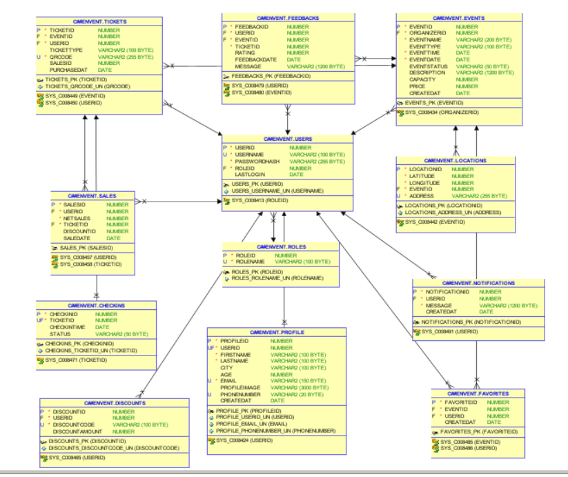

# 🎉 Eventify API

**Eventify** is a modular, scalable backend API built with **ASP.NET Core** and follows the **Onion Architecture**. It provides a robust structure for managing events, users, tickets, feedback, discounts, check-ins, notifications, and more.

---

## ⚙️ Tech Stack

- ASP.NET Core Web API
- Entity Framework Core
- SQL Server
- RESTful API
- JWT Authentication
- Onion Architecture
- AutoMapper
- FluentValidation
- MediatR
- Swagger (Swashbuckle)
- Serilog (for logging)
- Unit of Work & Repository Pattern

---

## 🧅 Architecture

The project is structured based on **Onion Architecture**, which separates concerns into different layers:

```
EventifyApi
│
├── Eventify.Domain         → Entities, Interfaces
├── Eventify.Application    → DTOs, Services, UseCases, Validators
├── Eventify.Infrastructure → Database, Repositories, Identity, Logging
├── Eventify.API            → Controllers, Middleware, Dependency Injection
```

This structure ensures:

- High maintainability
- Testability
- Separation of concerns
- Scalable and clean codebase

---

## 📦 NuGet Packages Used

- `Microsoft.EntityFrameworkCore`
- `Microsoft.EntityFrameworkCore.SqlServer`
- `Microsoft.AspNetCore.Authentication.JwtBearer`
- `AutoMapper.Extensions.Microsoft.DependencyInjection`
- `FluentValidation.AspNetCore`
- `MediatR.Extensions.Microsoft.DependencyInjection`
- `Swashbuckle.AspNetCore`
- `Serilog.AspNetCore`
- `BCrypt.Net-Next` (for password hashing)

---

## 🗄️ Database Design

The database consists of several key tables to support the application's features:

- Users
- Events
- Tickets
- Sales
- Discounts
- Feedbacks
- Checkins
- Notifications
- Locations
- Roles
- Profiles
- Favorites

### ⚠️ Note:

Please make sure to design the database according to the following diagram:



---

## 🚀 Getting Started

### Prerequisites

- [.NET SDK](https://dotnet.microsoft.com/download) (v6.0 or later)
- [SQL Server](https://www.microsoft.com/en-us/sql-server/sql-server-downloads)

### Installation

1. Clone the repository:

   ```bash
   git clone https://github.com/your-username/EventifyApi.git
   cd EventifyApi
   ```

2. Set up your database connection string in `Eventify.Infrastructure/appsettings.json`.

3. Apply EF Core migrations:

   ```bash
   dotnet ef database update --project Eventify.Infrastructure
   ```

4. Run the application:

   ```bash
   dotnet run --project Eventify.API
   ```

5. Visit Swagger UI:
   ```
   https://localhost:5001/swagger
   ```
   Open your browser and navigate to `http://localhost:5000/swagger` to explore the API endpoints.
   6 - Use Postman or any other API client to test the endpoints.
   7 - For authentication, use the `/api/auth/login` endpoint to obtain a JWT token and include it in the `Authorization` header for protected routes.
   8 - For testing, you can use the `/api/auth/register` endpoint to create a new user and then log in to get the token.
   9 - Use the `/api/events` endpoint to create, update, delete, and retrieve events.
   10 - Use the `/api/tickets` endpoint to manage tickets.
   11 - Use the `/api/feedbacks` endpoint to manage feedback.
   12 - Use the `/api/notifications` endpoint to manage notifications.
   13 - Use the `/api/discounts` endpoint to manage discounts.
   14 - Use the `/api/checkins` endpoint to manage check-ins.
   15 - Use the `/api/sales` endpoint to manage sales.
   16 - Use the `/api/locations` endpoint to manage locations.
   17 - Use the `/api/profiles` endpoint to manage profiles.
   18 - Use the `/api/favorites` endpoint to manage favorites.
   19 - Use the `/api/roles` endpoint to manage roles.
   20 - Use the `/api/users` endpoint to manage users.

---

## 🔐 Authentication

The API uses **JWT** for secure authentication. You'll need to:

1. Register a user via `/api/auth/register`
2. Log in via `/api/auth/login` to receive a token
3. Use the token in the `Authorization` header for protected endpoints:
   ```
   Authorization: Bearer <your-token>
   ```

---

## 🧪 Testing

You can run integration or unit tests using:

```bash
dotnet test
```

---

## 📁 Project Structure Overview

```
EventifyApi/
├── Eventify.API/            → Entry point, Swagger, Controllers
├── Eventify.Application/    → Business logic, DTOs, Validators
├── Eventify.Domain/         → Entity models, Interfaces
├── Eventify.Infrastructure/ → EF Core, Repositories, Identity
└── README.md
```

---

## 📬 Contact

For contributions, issues, or suggestions, please open an issue or a pull request on GitHub.

---

## 📄 License

This project is licensed under the [MIT License](LICENSE).
